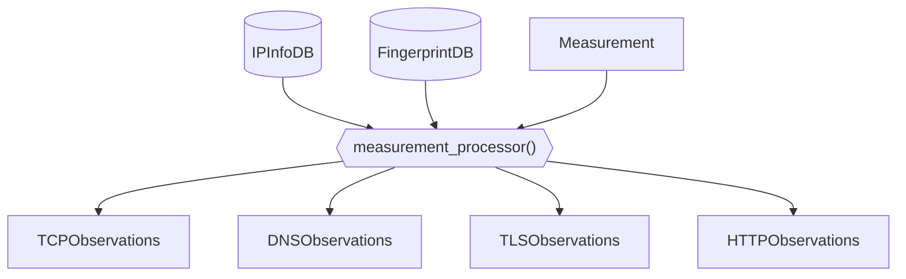
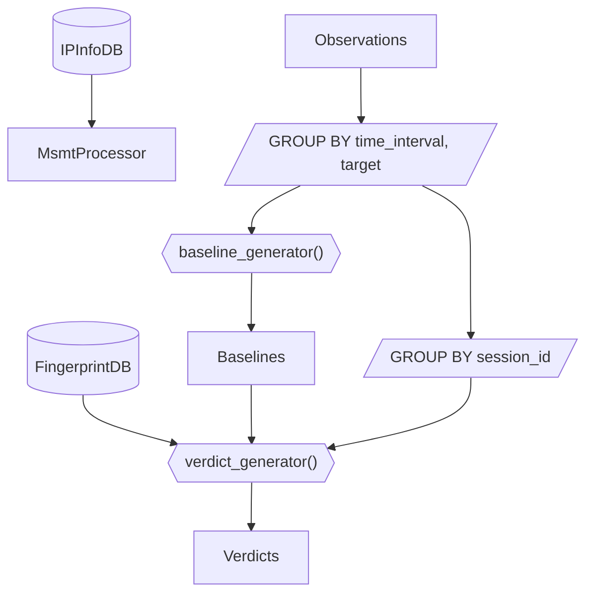

## OONI Data

## Data pipeline flow

This data pipeline works by dealing with the data in two different stages:
* Observation generation
* Verdict generation

### Observation generation

The goal of the Observation generation stage is to take raw OONI measurements
as input data and produce as output observations.

An observation is a timestamped statement about some network condition that was
observed by a particular vantage point. What these observations mean for the
target in question (ex. is there blocking or is the target down) is something
that is to be determined when looking at data in aggregate and is the
responsibility of the Verdict generation stage.

During this stage we are also going to enrich observations with metadata about
IP addresses (using the IPInfoDB) and detecting known fingerprints of
blockpages or DNS responses using the FingerprintDB.

The data flow of the observation generation pipeline looks as follows:



### Verdict generation

A verdict is the result of interpreting one or more network observations
collected within a particular testing session.

An important component to verdict generation is having some form of baseline to
establish some ground truth. This is necessary in order to establish if the
network condition we are seeing is a result of the target being offline vs it
being the result of blocking.

The data flow of the verdict generation pipeline looks as follows:


## Using this repo

To get yourself started with using this repo, run the following:
```
poetry install
mkdir output/
poetry run python oonidata/processing.py --csv-dir output/
```
