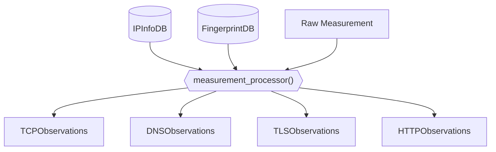
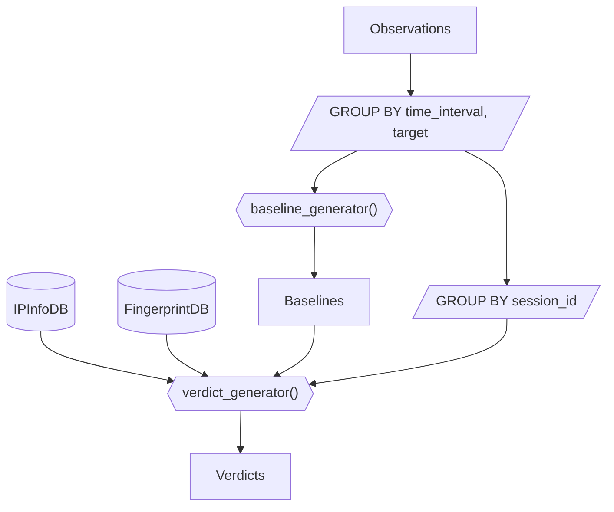
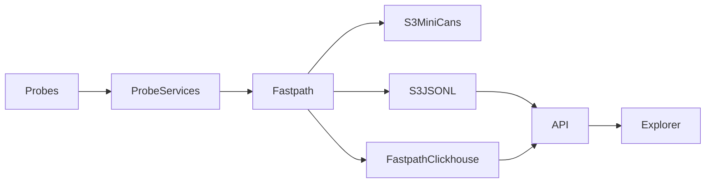
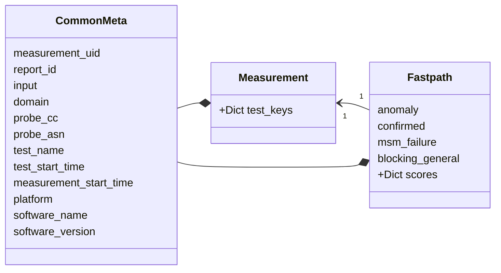

## OONI Data

## Using this repo

To get yourself started with using this repo, run the following:

```
poetry install
mkdir output/
poetry run python oonidata/processing.py --csv-dir output/ --geoip-dir ../historical-geoip/country-asn-databases --asn-map ../historical-geoip/as-orgs/all_as_org_map.json
```

## Architecture overview

This data pipeline works by dealing with the data in two different stages:
* Observation generation
* Verdict generation

### Observation generation

The goal of the Observation generation stage is to take raw OONI measurements
as input data and produce as output observations.

An observation is a timestamped statement about some network condition that was
observed by a particular vantage point. For example, an observation could be
"the TLS handshake to 8.8.4.4:443 with SNI equal to dns.google failed with
a connection reset by peer error".

What these observations mean for the
target in question (e.g., is there blocking or is the target down?) is something
that is to be determined when looking at data in aggregate and is the
responsibility of the Verdict generation stage.

During this stage we are also going to enrich observations with metadata about
IP addresses (using the IPInfoDB) and detecting known fingerprints of
blockpages or DNS responses using the FingerprintDB.

The data flow of the observation generation pipeline looks as follows:



The `measurement_processor` stage can be run either in a streaming fashion as
measurements are uploaded to the collector or in batch mode by reprocessing
existing raw measurements.

### Verdict generation

A verdict is the result of interpreting one or more network observations
collected within a particular testing session. For example, a verdict could
conceptually look like "we think there's interference with TLS handshakes
to 8.8.4.4:443 using dns.google as the SNI in country ZZ and AS0".

An important component to verdict generation is having some form of baseline to
establish some ground truth. This is necessary in order to establish if the
network condition we are seeing is a result of the target being offline vs it
being the result of blocking.

The data flow of the verdict generation pipeline looks as follows:


Some precautions need to be taken when running the `verdict_generator()` in
batch compared to running it in streaming mode.
The challenge is that you don't want to have to regenerate baselines that often
because it's an expensive process.

Let us first discuss the usage of the Verdict generation in the context of a
batch workflow. When in batch mode, we will take all the Observations in the desired
`time_interval` and `target`. In practice what we would do is process the data
in daily batches and apply the `GROUP BY` clause to a particular target.
It is possible to parallelise these task across multiple cores (and possibly
even across multiple nodes).

A baseline is some ground truth information about the target on that given day,
we generate this once and then apply it to all the observations for that target
from every testing session to establish the outcome of the verdict.

It's reasonable to do this over a time window of a day, because that will mean
that the baseline will be pertaining to at most 24h from the observation.

The challenge is when you want to do something similar for data as it comes in.
The problem there is that if you use data from the last day, you will end up
with a delta from the observation that can be up to 48h, which might be to much.
OTOH if you use data from the current day, you may not have enough data.
Moreover, it means that the result of the `verdict_generator` in batch mode
will differ from a run in streaming, which can lead to inconsistent results.

I think we would like to have the property of having results be as close as
possible to the batch run, while in streaming mode, and have some way of getting
eventual consistency.

The proposed solution is to generate baselines for all the targets (which is a
small set and can even be kept in memory) on a rolling 1h basis. This way
verdicts can be calculated based on a baseline that will be from a delta of at
most 24h.

Once the day is finished, we can re-run the verdict generation using the batch
workflow and mark for deletion all the verdicts generated in streaming mode, leading
to an eventual consistency.

The possible outcomes for the verdict are:

* dns.blockpage
* dns.bogon
* dns.nxdomain
* dns.{failure}
* dns.inconsistent
* tls.mitm
* tls.{failure}
* http.{failure}
* https.{failure}
* http.blockpage
* http.bodydiff
* tcp.{failure}


### Current pipeline

This section documents the current [ooni/pipeline](https://github.com/ooni/pipeline)
design.




