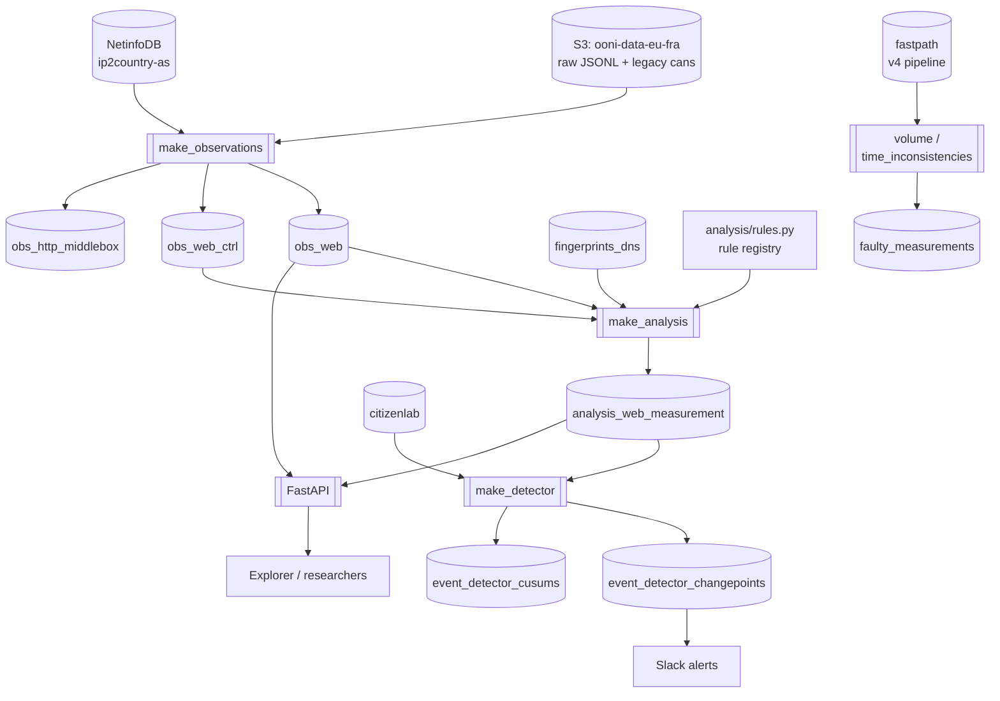

# Architecture

How the OONI data pipeline is put together: the processing tiers, what runs
where, and which pieces of infrastructure it depends on.

This document supersedes `oonipipeline/Design.md`. Companion documents:
[requirements.md](requirements.md) (what it must achieve),
[ontology.md](ontology.md) (what the entities mean),
[user-guide.md](user-guide.md) (consuming the output),
[developer-guide.md](developer-guide.md) (working on it),
[implementation-plan.md](implementation-plan.md) (current state and next steps).
Bare ids like `P2` or `O3` cite requirements.md.

**Status markers**: **[built]** is in production, **[partial]** exists but is
not fully wired, **[mvp]** is in the current delivery scope, **[later]** is
deferred (see [ontology.md](ontology.md) Appendix A). Unmarked means built.

### How the pipeline got here

This is the fifth major iteration. The earlier ones, for context:

| Version | Approach | Retired |
|---|---|---|
| v0 | Raw JSON written into a public `www` directory | ~2013 |
| v1 | Custom CLI scripts over MongoDB | ~2015 |
| v2 | [Luigi](https://luigi.readthedocs.io/en/stable/) | ~2017 |
| v3 | [Airflow](https://airflow.apache.org/) | ~2020 |
| v4 | Custom scripts and systemd units, known as *fastpath* | still running |
| v5 | What this document describes | in production |

v4 has not been switched off. It still produces the `fastpath` table, which the
two data-quality jobs read (§2) and which nothing else in v5 depends on.
Retiring it is tracked in [implementation-plan.md](implementation-plan.md) §4.

---

## 1. The tiered model

The pipeline is a chain of tiers, each with one job, each derived from the tier
below it. The organising principle is **push inference downstream**: earlier
tiers record facts, later tiers draw conclusions. A conclusion drawn too early
destroys the evidence needed to draw a better one later.

| Tier | Table | Produced by | Grain | Status |
|---|---|---|---|---|
| 0 Raw | S3 JSONL | OONI collector (external) | measurement | built |
| 1 Observation | `obs_web`, `obs_web_ctrl`, `obs_http_middlebox` | `make_observations` | measurement × endpoint | built |
| 2 Evidence / judgment | `analysis_web_measurement` | `make_analysis` | measurement × target | built |
| 3 Cell state | *(a view, not a table)* | `GROUP BY` over tier 2 | target × network × layer × hour | **[mvp]** |
| 4 Changepoint | `event_detector_changepoints`, `event_detector_cusums` | `make_detector` | series × signal | built |
| 5 Event | `events` | n/a | cc × target-set × time | **[mvp]** |

Tiers 3 and 5 are the two structural gaps. Today tier 4 reads tier 2 directly,
computing its own hourly aggregate inline, which is why measurement counts are
discarded and why a national event emits one alert per
`(cc, asn, domain, layer)` rather than one alert per event.

Tier 3 is deliberately **a view rather than a table** while its grain is still
being learned. It holds per-layer histograms of rule firings, from which
consensus, sample size and ambiguity all derive ([ontology.md](ontology.md) §9).
If it is ever materialised, materialise it as a scheduled rebuild per closed
window, not an insert-time materialized view (§3.1).

Two properties the design targets, neither fully achieved yet:

- **Determinism (P2, P3).** Every tier must be recomputable from the tier below
  for a given time range, producing identical output. Three things currently break it:
  tier-4 state is path-dependent (§4.4); reference data is joined as of *run*
  time, so a rebuild scores old measurements against today's fingerprint corpus;
  and tier-2 rows are overwritten in place on re-analysis, with no record of
  what they said before. The MVP addresses all three (snapshotted reference
  inputs, stateless detection, an append-only alert log).
- **Recalibration without reprocessing (E1).** Tier 2 records *which rule fired*
  (`top_*_rule_id`), so changing a rule's weight can be a join against tier 2
  rather than a re-scan of tier 1. The limit: only the *winning* rule is
  recorded, so a rule split or reorder still needs a re-scan until the full
  fired-rule set is persisted (plan §3.9).

### Data flow



Note `fastpath` is the *v4* pipeline's table, not produced here. The two data
quality jobs read it; nothing else in v5 depends on it.

---

## 2. Infrastructure components

| Component | Role | Notes |
|---|---|---|
| **ClickHouse** | The only datastore. All tiers. | Prod: `clickhouse1.prod.ooni.io`. Tests pin 25.2. |
| **Apache Airflow** | Scheduler for every batch job | DAGs in `dags/`. Config via Airflow `Variable`s. |
| **AWS S3** (`ooni-data-eu-fra`) | Raw measurement source, and the netinfo DB | Read anonymously (unsigned requests), no credentials needed to reprocess. |
| **FastAPI** | Read API over tiers 1–2 | `ooni/backend/ooniapi/services/oonimeasuremen/`. Deployed separately from the pipeline. |
| **GitHub** (`ooni/blocking-fingerprints`) | Blockpage fingerprint source | Fetched hourly as CSV. |
| **GitHub** (`citizenlab/test-lists`) | Domain categorisation, detector watchlist | Cloned every 30 min. |
| **Slack webhook** | Changepoint alerting | Optional; gated by an Airflow Variable. Fire-and-forget: no delivery monitoring, so "no events" and "no delivery" look identical (O3; plan §3.11). |
| **OpenTelemetry / Prometheus** | Telemetry | Optional, via `telemetry_endpoint` / `prometheus_bind_address` in settings. |

Configuration is a TOML file located by the `CONFIG_FILE` environment variable,
overlaid by environment variables (`oonipipeline/settings.py`, pydantic-settings).

### Scheduling

| DAG | Schedule | Tasks |
|---|---|---|
| `hourly_batch_measurement_processing` | `30 * * * *` | observations → analysis → gate → detector; plus volume and time-inconsistency checks as independent roots |
| `batch_measurement_processing` | `30 0 * * *` | observations → analysis (daily backfill path) |
| `halfhour_updaters` | `00/30 * * * *` | citizenlab test lists |
| `hourly_updaters` | `@hourly` | blocking fingerprints |
| `weekly_updaters` | `@weekly` | ASN metadata |

The 30-minute offset gives the upstream collector time to finish uploading the
hour's measurements. Note the daily DAG repairs tiers 1 and 2 only: it has no
detector task, so a measurement arriving later than its hour's run updates the
tables but never reaches detection. Late uploads correlate with exactly the
networks being interfered with, which makes this a detection gap rather than a
bookkeeping one (D2; plan §3.10). Both DAGs also fire at 00:30, writing the same
window twice (§4.5). The event detector sits behind a `ShortCircuitOperator`
reading the `enable_event_detector` Airflow Variable, so alerting can be paused
without editing the DAG. That matters when backfilling, because the detector is
stateful (see [developer-guide.md](developer-guide.md)).

The volume and time-inconsistency tasks have no upstream dependency because they
read `fastpath`, which this pipeline does not produce. That is deliberate, not
an oversight.

---

## 3. Table inventory

**Observation tier**: generated from dataclass models via
`db/create_tables.py`, so the Python model is the schema's source of truth.

- `obs_web`: one row per (measurement, endpoint), merging the DNS answer, TCP
  connect, TLS handshake and HTTP transaction that relate to the same address.
  Wide and sparse by design.
- `obs_web_ctrl`: the web_connectivity test helper's view of the same hostname.
  **Only web_connectivity produces this.**
- `obs_http_middlebox`: HIRL/HFM results. Different shape, hence a different
  table.

**Judgment tier**

- `analysis_web_measurement`: per measurement: `(blocked, down, ok)` per layer,
  the top failure per layer, and `top_{dns,tcp,tls}_rule_id`.

**State tier** **[mvp]**

- Cell state: a view over tier 2, not a table. §3.1 below; semantics in
  [ontology.md](ontology.md) §9.

**Detection tier**

- `event_detector_cusums`: per `(cc, asn, domain)` CUSUM accumulator state.
- `event_detector_changepoints`: emitted transitions.

**Reference data**: externally maintained, refreshed by updater DAGs:
`fingerprints_dns`, `fingerprints_http`, `citizenlab`, `citizenlab_flip`,
`asnmeta`. The fingerprint tables are `EmbeddedRocksDB` and are swapped in
atomically via `EXCHANGE TABLES`.

**Data quality**: `faulty_measurements`, written by the volume and
time-inconsistency jobs.

### 3.1 Cell state **[mvp]**

Tier 3 is a **view**, not a table. Per
`(target, probe_cc, probe_asn, resolver_asn, ts_hour)` it holds per-layer
histograms of rule firings plus counts:

```sql
SELECT
    domain, probe_cc, probe_asn,
    -- Kept as its own key column for DNS series, never substituted for
    -- probe_asn: on-path injection answers for whatever resolver was
    -- addressed, so folding the resolver into the network key would attribute
    -- a middlebox to the resolver operator's AS. See ontology §11.
    resolver_asn,
    toStartOfHour(measurement_start_time)      AS ts_hour,
    sumMap([top_dns_rule_id], [toUInt32(1)])   AS dns_rule_counts,
    sumMap([top_tcp_rule_id], [toUInt32(1)])   AS tcp_rule_counts,
    sumMap([top_tls_rule_id], [toUInt32(1)])   AS tls_rule_counts,
    count()                                    AS n_measurements,
    uniqIf(probe_id, probe_id != '')           AS n_probes,
    uniq(report_id)                            AS n_sessions
FROM analysis_web_measurement
GROUP BY domain, probe_cc, probe_asn, resolver_asn, ts_hour;
```

DNS series read this grouped by the full key; TCP and TLS series re-aggregate
over `resolver_asn`, which `sumMap` merges for free. Per layer, the verdict is
the dominant **outcome class** (rules grouped blocked / down / ok via the
registry, so the fine-grained blocked vocabulary does not split its own vote),
the mechanism is the dominant rule within it, and masked no-data rules are
excluded from detector signals. Semantics and the counting caveats are in
[ontology.md](ontology.md) §9; `n_probes` counts distinct credentialed probes
and `n_sessions` is only an upper bound on independence (A3).

Promotion path, if measurement shows the view too slow: a scheduled rebuild per
closed window into a plain table. **Not** an insert-time `AggregatingMergeTree`
materialized view: MVs fire per insert and never observe `ReplacingMergeTree`
replacement, so nightly re-analysis would double-count every re-scored row.

## 4. Tradeoffs

Each closes with the requirement conflict it embodies, in
[requirements.md](requirements.md)'s assessment vocabulary.

### 4.1 One wide observation table, not per-protocol tables

`obs_web` merges DNS, TCP, TLS and HTTP into one row per endpoint.

**Buys:** the common question, "what happened when this probe tried to reach
this address?", is a single-table scan with no joins. Cross-layer scoring
("TCP already failed, so discard the TLS verdict") reads sibling columns
directly. Different nettests with the same shape become analysable by the same
code.

**Costs:** the table is sparse: an HTTP-only row has ~40 null columns. Wide
array columns (`tls_certificate_chain_fingerprints`,
`tls_end_entity_certificate_san_list`) and long strings dominate storage and
background merge cost even though the analysis query never reads them. The
merge logic that decides which sub-measurements belong in one row
(`consume_web_observations`) is complicated, and is where transformer
bugs concentrate.

**Mitigation order if storage becomes the constraint:** column codecs and
`LowCardinality` first, then TTL tiering to cold volumes, and only then a
hot/cold table split, which is a real schema break and should have to earn it.
ClickHouse is columnar, so the wide columns are not being *read* on the hot
path; the cost is storage and merges, not query time.

**Requirements:** serves M1 (the ladder's endpoint questions are one scan) at
an infrastructure price, with the mitigation ladder recorded above rather than
pre-built (X1). No requirement is traded.

### 4.2 Batch, hourly, on a fixed schedule

**Buys:** simple, restartable, and reprocessable. That was a stated design goal
from the start, since the whole database must be rebuildable from S3. Backfill
is the same code path as live processing.

**Costs:** up to ~90 minutes of latency from measurement to alert, and a control
window pinned to the same hour as the measurements being scored (§4.4).

**Requirements:** meets P1 and P2 (one code path, replayable) inside D3's
latency bar, so the latency is spent, not traded. The claim that backfill is
the same path as live holds for tiers 1–2 today and extends to detection only
once plan §3.10 lands (O4).

### 4.3 Scoring expressed as SQL, executed in ClickHouse

The judgment tier is one large `INSERT .. SELECT`.

**Buys:** no data leaves the database; the join against control data and
fingerprints happens where the data lives. This is orders of magnitude faster
than streaming rows into Python.

**Costs:** historically the rules were literal `multiIf` cascades inside an
f-string, which made them untestable without a live ClickHouse and made the
weights invisible to any tooling. This is now mitigated, the rules live in
`analysis/rules.py` as data and the SQL is generated from them, but the
execution model still means a scoring bug surfaces as a ClickHouse error rather
than a Python traceback, and the query is sensitive to ClickHouse version (the
analysis query requires the newer analyzer; see
[developer-guide.md](developer-guide.md)).

**Requirements:** an execution choice; nothing traded. The rules-as-data
extraction it forced is what makes rule ids persistable, which E1 and E6 build
on. The residual cost is developer experience, priced in
[developer-guide.md](developer-guide.md) §6.1.

### 4.4 The control window is the analysis window

**Current behaviour:** both control subqueries bind the same
`start_time`/`end_time` as the experiment, so the control for an hourly run is
built from that same hour of `obs_web_ctrl`, plus the same hour of `obs_web` for
TLS-consistent addresses.

**Buys:** determinism and minimal scanning. Re-running an hour reads exactly the
same rows and produces the same control, and each run scans one hour rather than
a day. The `toStartOfDay` grouping in the query makes this *look* like a
day-grained window; it is not one, it is a join key that is constant inside an
hourly window.

**Costs:** the window is narrow. A hostname the test helper did not resolve in
that hour has no control rows at all, the `LEFT JOIN` misses, and the DNS
cascade cannot distinguish "the control disagrees" from "there is no control".
Everything falls through to `answer_unmatched` at 0.75 blocked. This is a
scoring defect rather than a cost problem, and the fix is a rule, not a table:
see [implementation-plan.md](implementation-plan.md) §3.3.

If a materially wider baseline (trailing 24h or 7d) is ever wanted, it needs a
precomputed aggregate: scanning that much raw `obs_web_ctrl` on every hourly run
is not affordable. That is a decision to take on evidence, after §3.3.

**Requirements:** buys P2 for tier 2. The narrowness itself is not the traded
item; scoring "no control" as if it were contrary evidence is, and that
violates E3 and E4 until the plan §3.3 rule lands. Widening the window is a
recorded decision-on-evidence (X1), not a gap.

### 4.5 ClickHouse as the only datastore

**Buys:** one system to operate; column store suits the workload; aggregate
engines (`ReplacingMergeTree`, `SummingMergeTree`, `AggregatingMergeTree`) do a
lot of the incremental-maintenance work for free.

**Costs:** no transactions, so multi-table consistency is the caller's problem.
`ReplacingMergeTree` deduplication is *eventual*: a `SELECT` can see both rows
until parts merge, which is a real correctness trap for anything reading its own
writes. Because the hourly and daily DAGs both process every window, each
analysis row is written at least twice, so during merge lag count queries can
read up to 2x; published counts need `FINAL` (see the user guide). There is no
foreign-key enforcement, so referential integrity between tiers is by
convention only.

One durability note that outranks the rest: production is a single node, and the
detection record (`event_detector_cusums`, `event_detector_changepoints`,
`faulty_measurements`) is the only state *not* rebuildable from S3. Those tables
are the published history and need backups; everything else is disposable.

**Requirements:** meets O1, one system to operate. Three things are traded
and each has a path back: E2's exact-counts clause, spent to eventual dedup
plus the double-write, is repaid by the `FINAL` read policy in the user guide;
P4, which a `ReplacingMergeTree` overwrite cannot honour alone, is repaid by
plan §3.9 and the run-versioned tier recorded in the plan's Later table; and
P1/O5 stay violated until the non-rebuildable detection record is backed up.

### 4.6 Reference data fetched from external repositories

Fingerprints, test lists and ASN metadata come from GitHub and S3.

**Buys:** OONI's fingerprint corpus is community-maintained and shared across
tools; not forking it means improvements land everywhere.

**Costs:** an upstream schema change silently degrades scoring. The concrete
case: the analysis query's fingerprint join is an equality match, which
implements `pattern_type = 'full'` only. If upstream adds a `prefix` or
`regexp` DNS fingerprint, it would simply never match and the blockpage rule
would silently stop firing for it. This is now guarded by a canary test rather
than by hope, which is the general pattern to follow for externally-owned data.

Two further costs, both unguarded today. The corpus is functionally *scoring
code*, and no fetched revision is recorded anywhere: a verdict cannot name the
fingerprint state that produced it, and re-running a past window scores it
against today's corpus. And the only content gate is a row-count range, so a
single altered or added fingerprint row changes verdicts with no test failing.
Snapshotting per run and recording the fetched commit SHA is MVP work (plan
§3.9); the canaries also only run in CI, while the data refreshes hourly in
production, which is what the scheduled health checks in plan §3.11 exist for.

**Requirements:** the community corpus is constraint C3, not a choice to
relitigate. The unguarded parts violate A5 and P3 until plan §3.9 and §3.11
land; the canary pattern is the accepted mitigation shape for what CI can see.

### 4.7 Airflow, and config in Airflow Variables

**Buys:** backfill, retry, and catchup are solved problems; operators can pause
a task from the UI without a deploy, which the stateful detector needs.

**Costs:** configuration lives in three places (TOML file, environment,
Airflow Variables) with no single source of truth. Catchup after downtime can
schedule historical runs concurrently and out of order against an
order-dependent detector, and the pause-before-backfill rule is enforced by
convention alone; stateless detection (plan §3.10) removes the hazard rather
than guarding it. DAG task arguments are passed
as `op_kwargs` dicts and forwarded as keyword arguments, so a stale key is a
runtime `TypeError` rather than a parse error, a class of bug that has occurred
and is now covered by a static test.

**Requirements:** buys the backfill and retry machinery O4 needs. The
config-in-three-places debt and the pause-before-backfill convention are the
remembered class of safeguard O2 prices as weaker, and the detector case sits
squarely in O2's exception (silent failure, state unrecoverable from the
archive), which is why plan §3.10 replaces that ritual with a mechanism rather
than hardening it.
