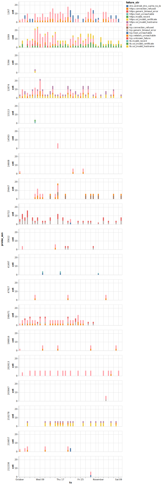
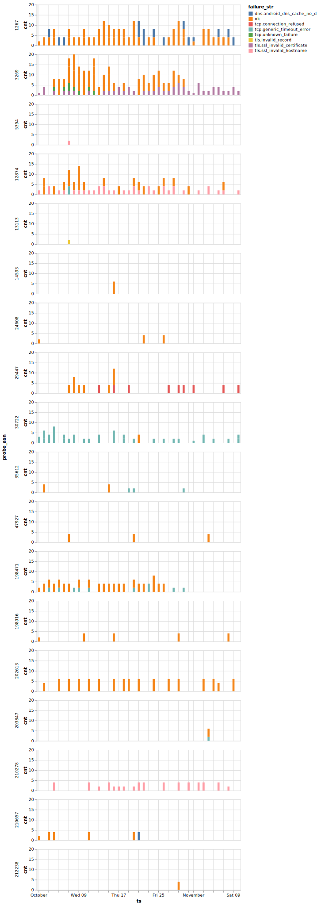
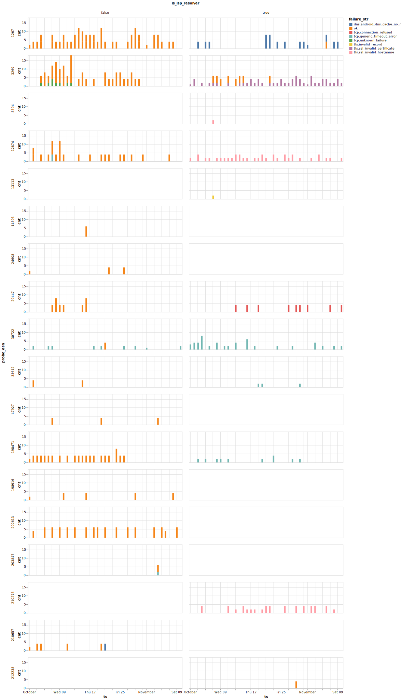

# OONI Data Analysis Docs

In this document you will find information on how to perform analysis of OONI
data based on tables available in clickhouse.

It will include useful code snippets and descriptions about the semantics of
the various columns in the relevant database tables.

The main tables you should be looking at are the following:
* `fastpath`, which contains high level metadata about measurements as well as
  the fastpath analysis output which is primarily extracted from the probe.
  Each row in here maps to one measurement.
* `obs_web`, which contains much richer metadata that has been extracted from
  measurements. In here each row maps to one or more measurements.
* `obs_web_ctrl`, which contains metadata related to control measurements from
  the `web_connectivity` test.
* `analysis_web_measurement`, which contains the analysis outputs coming from
  OONI Pipeline v5.

For more details about the semantics of certain fields refer to the [ooni/spec documentation](https://github.com/ooni/spec/tree/master/data-formats).

## Fastpath
table: `fastpath`

This table contains high-level metadata about measurements and fastpath
analysis outputs. Each row maps to a single measurement.

- **measurement_uid** – Unique identifier for the measurement.
- **report_id** – Identifier of the the measurement set. The tuple (`report_id`, `input`) loosely maps to an individual measurement.
- **input** – The input tested (URL, domain, or other).
- **probe_cc** – Country code of the probe.
- **probe_asn** – Autonomous System Number (ASN) of the probe network.
- **test_name** – Name of the OONI test performed.
- **test_start_time** – Time the test session was initiated. Measurements sharing the same `report_id` will share the same `test_start_time`.
- **measurement_start_time** – Time the specific measurement began.
- **filename** – Name of the original uploaded report file.
- **scores** – Serialized scoring information (heuristics, flags).
- **platform** – Platform type (e.g., mobile, desktop).
- **anomaly** – Fastpath assessment of whether the measurement was anomalous (`t` or `f`).
- **confirmed** – Fastpath assessment of whether blocking/censorship was confirmed. This is done using our blocking fingerprints.
- **msm_failure** – Indicates if the measurement failed and should therefore be ignored.
- **domain** – Domain derived from the input.
- **software_name** – Name of the OONI probe software (eg. `ooniprobe-android`)
- **software_version** – Version of the OONI probe software.
- **test_version** – Version of the nettest.
- **architecture** – System architecture of the probe (e.g., arm64).
- **engine_name** – Name of the test engine.
- **engine_version** – Version of the test engine.
- **test_runtime** – Duration of the test run. Goes from `measurement_start_time` until the end of the individual measurement.
- **ooni_run_link_id** – If present, the ID of the OONI Run link used to trigger this measurement.

The following columns should be ignored
- **control_failure**
- **blocking_general**
- **is_ssl_expected**
- **page_len**
- **page_len_ratio**
- **server_cc**
- **server_asn**
- **server_as_name**
- **update_time**
- **blocking_type**
- **test_helper_address**
- **test_helper_type**


## Web Observations
table: `obs_web`

This table contains enriched metadata extracted from measurements. Each row
corresponds to one observation, which may map to multiple measurements.

All observations that are related to the same network transaction are mapped onto the same row. For example:
* DNS resolution for example.com -> [1.2.3.4, 2.3.4.5]
* TCP Connect to 1.2.3.4 on port 443
* TLS handshake for 1.2.3.4 on port 443
* HTTPS request

Will lead to the DNS, TCP, TLS and HTTPS observations for the IP target 1.2.3.4
ending up on the same row.

### Measurement identifiers
- **measurement_uid** – Unique identifier of the measurement.
- **observation_idx** – Index of the observation within the measurement counting from 1.
- **input** – Tested input (nullable, typically a URL or domain).
- **report_id** – Identifier of the the measurement set. The tuple (`report_id`, `input`) loosely maps to an individual measurement.
- **ooni_run_link_id** – If present, the ID of the OONI Run link used to trigger this measurement.
- **measurement_start_time** – Timestamp of when the measurement started (UTC).
- **created_at** – Time the record was inserted into this table.

### Software and test metadata
- **software_name** – Name of the probe software (e.g., ooniprobe-android).
- **software_version** – Version of the probe software.
- **test_name** – Name of the test performed (e.g., `web_connectivity`).
- **test_version** – Version of the test implementation.
- **bucket_date** – The bucket timestamp in which this measurement is stored, used for partitioning the date. Derived form the upload time.
- **engine_name** – Name of the test engine used (eg. `ooniprobe-engine`, `miniooni`)
- **engine_version** – Version of the test engine.
- **architecture** – CPU architecture of the probe device (e.g., arm64).
- **platform** – Platform type (e.g., android, ios, linux).
- **origin** – Origin of the measurement (eg. `autorun`, `ooni-run`, `checkin`)

### Probe network metadata
- **probe_asn** – ASN of the probe’s network.
- **probe_cc** – Country code (ISO 3166-1 alpha-2) of the probe.
- **probe_as_org_name** – Organization name for the probe’s ASN.
- **probe_as_cc** – Country code associated with the probe’s ASN.
- **probe_as_name** – Registered name for the probe’s ASN.
- **network_type** – Type of network (e.g., wifi, mobile).

### Resolver metadata
- **resolver_ip** – IP address of the DNS resolver used, looked up using `whoami.v4.powerdns.org`.
- **resolver_asn** – ASN of the DNS resolver.
- **resolver_cc** – Country code of the DNS resolver.
- **resolver_as_org_name** – Organization name of the resolver ASN.
- **resolver_as_cc** – Country code of the resolver ASN.
- **resolver_is_scrubbed** – Whether resolver metadata was scrubbed (1 or 0).
- **resolver_asn_probe** – ASN of the resolver as seen from the probe.
- **resolver_as_org_name_probe** – Resolver organization name as seen from the probe.

### Target / connection metadata
- **target_id** – Identifier of the target (nullable).
- **hostname** – Hostname contacted in this observation.
- **ip** – IP address contacted.
- **port** – Destination port.
- **ip_asn** – ASN of the contacted IP.
- **ip_as_org_name** – Organization name of the IP ASN.
- **ip_as_cc** – Country code of the IP ASN.
- **ip_cc** – Geolocated country code of the IP.
- **ip_is_bogon** – Whether the IP is bogon (1 or 0).
- **transaction_id** – Transaction identifier (nullable).

### DNS-related fields
- **dns_query_type** – DNS query type (e.g., A, AAAA, CNAME).
- **dns_failure** – Failure reason for DNS resolution (nullable).
- **dns_engine** – DNS engine used (e.g., system, doh).
- **dns_engine_resolver_address** – Address of the resolver as reported by the engine.
- **dns_answer_type** – Type of DNS answer received.
- **dns_answer** – Raw DNS answer value (e.g., IP, CNAME).
- **dns_answer_asn** – ASN corresponding to the DNS answer IP.
- **dns_answer_as_org_name** – Organization name of the DNS answer ASN.
- **dns_t** – Relative time offset of when the DNS transaction was completed.

### TCP-related fields
- **tcp_failure** – Failure string during TCP connection (nullable).
- **tcp_success** – Whether the TCP connection succeeded (1) or not (0).
- **tcp_t** – Relative time offset of when the TCP transaction was completed.

### TLS-related fields
- **tls_failure** – Failure string during TLS handshake (nullable).
- **tls_server_name** – Server Name Indication (SNI) used.
- **tls_outer_server_name** – Outer SNI in case of Encrypted ClientHello (ECH).
- **tls_echconfig** – ECH configuration if used.
- **tls_version** – TLS protocol version negotiated (e.g., TLS 1.3).
- **tls_cipher_suite** – Cipher suite negotiated.
- **tls_is_certificate_valid** – Whether the certificate was valid (1 or 0).
- **tls_end_entity_certificate_fingerprint** – Fingerprint of the server certificate.
- **tls_end_entity_certificate_subject** – Subject of the server certificate.
- **tls_end_entity_certificate_subject_common_name** – Common Name (CN) of the subject.
- **tls_end_entity_certificate_issuer** – Issuer of the certificate.
- **tls_end_entity_certificate_issuer_common_name** – Common Name (CN) of the issuer.
- **tls_end_entity_certificate_san_list** – Subject Alternative Name list from the certificate.
- **tls_end_entity_certificate_not_valid_after** – Certificate expiration time.
- **tls_end_entity_certificate_not_valid_before** – Certificate validity start time.
- **tls_certificate_chain_length** – Number of certificates in the chain.
- **tls_certificate_chain_fingerprints** – Fingerprints of the certificates in the chain.
- **tls_handshake_read_count** – Number of read operations during TLS handshake.
- **tls_handshake_write_count** – Number of write operations during TLS handshake.
- **tls_handshake_read_bytes** – Bytes read during TLS handshake.
- **tls_handshake_write_bytes** – Bytes written during TLS handshake.
- **tls_handshake_last_operation** – Last operation attempted during handshake.
- **tls_handshake_time** – Duration of the TLS handshake.
- **tls_t** – Relative time offset of when the TCP transaction was completed.

### HTTP-related fields
- **http_request_url** – URL requested.
- **http_network** – Network used for performing the request (NULL, udp, tcp).
- **http_alpn** – Application-Layer Protocol Negotiation result (NULL, h2).
- **http_failure** – Failure string during HTTP request (nullable).
- **http_request_body_length** – Length of the HTTP request body.
- **http_request_method** – HTTP method used (e.g., GET, POST).
- **http_runtime** – Duration of the HTTP request/response.
- **http_response_body_length** – Length of the HTTP response body.
- **http_response_body_is_truncated** – Whether the response body was truncated (1 or 0).
- **http_response_body_sha1** – SHA1 checksum of the HTTP response body.
- **http_response_status_code** – HTTP status code received.
- **http_response_header_location** – Value of the `Location` header (if present).
- **http_response_header_server** – Value of the `Server` header (if present).
- **http_request_redirect_from** – URL from which this request was redirected.
- **http_request_body_is_truncated** – Whether the request body was truncated (1 or 0).
- **http_t** – Total HTTP runtime duration.

### Analysis
- **probe_analysis** – The result of the probe level analysis. Generally
  matches what is seen in the fastpath.

## Examples

It's useful to define a function for running SQL queries and returning a pandas
dataframe targeting the clickhouse database, as follows:
```
from clickhouse_driver import Client as Clickhouse

def click_query(q, params=None, settings=None):
    click = Clickhouse("localhost")
    return click.query_dataframe(q, params=params, settings=settings)
```

### Aggregating measurements by failure counts

Suppose you would like to plot observations by failure string so that you can
assess the reason why we are failing to connect to a specific target.

We make the assumption that if DNS fails, that will lead to TCP failing, if TCP
fails, that will lead to TLS failing and if TLS fails that will lead to HTTPS
failing.

This assumption holds true for most `web_connectivity` measurements (n.b. it's
not necessarily going to be the case for `web_connectivity` 0.5).

We can use the following query:

```
df_agg = click_query("""
WITH multiIf(
    dns_failure IS NOT NULL, tuple('dns', dns_failure),
    tcp_failure IS NOT NULL, tuple('tcp', tcp_failure),
    tls_failure IS NOT NULL, tuple('tls', tls_failure),
    http_failure IS NOT NULL, tuple('https', http_failure),
    tuple('ok', '')
) as failure,
failure.1 as failure_class,
IF(startsWith(failure.2, 'unknown_failure'), 'unknown_failure', failure.2) as failure_str_part,
failure.2 as failure_str_raw
SELECT 
probe_cc,
probe_asn,
probe_as_org_name,
toStartOfDay(measurement_start_time) as ts,
hostname,
resolver_asn,
IF(failure_class = 'ok', 'ok', concat(failure_class, '.', failure_str_part)) as failure_str,
COUNT() as cnt
FROM obs_web
WHERE measurement_start_time > %(measurement_start_day)s
AND measurement_start_time < %(measurement_end_day)s
AND probe_cc IN %(cc_list)s
AND hostname = %(hostname)s
GROUP BY probe_cc, probe_asn, probe_as_org_name, hostname, resolver_asn, ts, failure_str
""", params={
    "measurement_start_day": "2024-10-01",
    "measurement_end_day": "2024-11-11",
    "cc_list": ["IT"],
    "hostname": "archive.ph"
})
```

Note how in the `GROUP BY` section we are using as a grouping key `probe_asn`
and `resolver_asn`. This is helpful because the blocking signal may differ from
network to network, but in the case of DNS it will also be dependent on the DNS
resolver that the probe is configured to use (eg. probes on the same network
might produce different results if one is using the ISP provided resolver which
implements filtering vs a public resolver that does not).

We can then plot these results with:
```
alt.Chart(df_agg).mark_bar().encode(
    x='ts',
    y='cnt',
    color='failure_str',
    row='probe_asn',
    tooltip=['failure_str', 'cnt', 'ts', 'hostname']
).properties(
    width=500,
    height=100
)
```



In the resulting plot it's worth noting two things:
1. The presence of several `host_unreachable` and `network_unreachable` failure
   strings. These are likely caused by the lack of IPv6 connectivity in the
probe.
2. Several failures appear as both `tls.$(failure)` and `https.$(failure)`.
   This is likely the result of double counting when the data pipeline is not
able to map a HTTPS transaction to the corresponding TLS handshake, hence they
end up on two separate rows.

Depending on your use-case you may want to exclude these instance by applying a
pandas filter such as:
```
alt.Chart(df_agg[
    (~df_agg['failure_str'].str.startswith('https'))
    & ~(
        (df_agg['failure_str'].str.contains('host_unreachable'))
        | (df_agg['failure_str'].str.contains('network_unreachable'))
    )
]).mark_bar().encode(
    x='ts',
    y='cnt',
    color='failure_str',
    row='probe_asn',
    tooltip=['failure_str', 'cnt', 'ts', 'hostname']
).properties(
    width=500,
    height=100
)
```



Which results in a much cleaner signal.

Finally, we will now notice how the signal is still not so stable across the
`probe_asn`, which is likely caused by differences in the DNS configuration.

We can account for this by computing a new column which determines if the resolver is the ISP provided one or not:
```
df_agg['is_isp_resolver'] = df_agg['probe_asn'] == df_agg['resolver_asn']
```

and then placing them on two different columns:
```
alt.Chart(df_agg[
    (~df_agg['failure_str'].str.startswith('https'))
    & ~(
        (df_agg['failure_str'].str.contains('host_unreachable'))
        | (df_agg['failure_str'].str.contains('network_unreachable'))
    )
]).mark_bar().encode(
    x='ts',
    y='cnt',
    color='failure_str',
    row='probe_asn',
    column='is_isp_resolver',
    tooltip=['failure_str', 'cnt', 'ts', 'hostname']
).properties(
    width=500,
    height=100
)
```



We can now see that this mostly clears up the signal.
