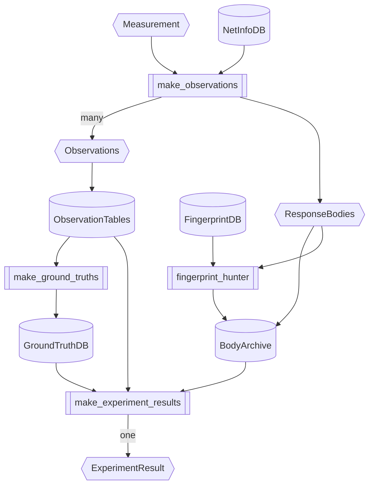
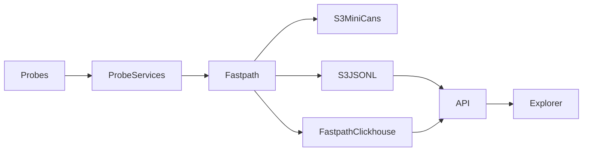
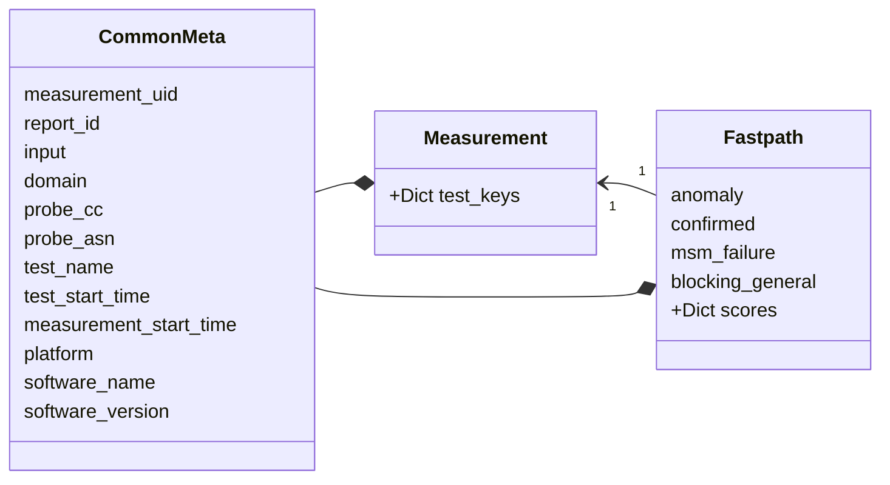

# OONI Pipeline v5 Design

## Design goals and requirements

The goal of the OONI Pipeline v5 is to overcome some of the limitation of the
current data pipeline (v4 aka fastpath) empowering data analysts both internal
to OONI, but also third-parties to perform in-depth analysis of measurement
faster.

Below we will outline each of the main design goals and explain why they are
needed.

### Expose a queriable low level view on measurements

Currently it's only possible to query measurement at a granularity which is as
fine as a measurement.

This means that it's only possible to answer questions which the original
designer of the experiment had already thought of.

On the other hand the new pipeline breaks down measurements into distinct
observations (think 1 DNS query and answer or 1 TLS handshake towards a
particular IP:port tuple). By doing this kind of decomposition it's possible
to perform fast ad-hoc analysis (for example give me all the observations for a
TLS handshake towards this particular IP) while doing research, but also be the
starting point for building a more iterative approach to automatic analysis.

This also lends itself nicely to a more explorative way of looking at OONI
data, which is not so dependent on the specifics of OONI nettests.

Finally, in doing so we are not so tied to the rigidity of existing OONI
nettests, since several different nettests may end up having the same
observation based layout, making it possible to analyse different nettests in
the same way.

### Reprocessing of data should be fast

Since we are unlikely to get the analysis and observation generation right on
the first go and will likely want to iterate quickly on it, the system should
be designed in such a way where it's possible to reprocess all historical data
fast.

Currently an important limiting factor to this is the data format in which data
is stored in the s3 buckets, however the architecture of the system should be
designed in such a way where the reprocessing capabilities can scale
horizontally, allowing us to reprocess the data quickly if we need to.

This serves both the research efforts, since we don't have to wait long to
improve our analysis as we work on research, but also serves as disaster
recovery measure, since we can rebuild the database from scratch directly from
the raw data.

### Analysis should be performed in the pipeline

Currently analysis is done in the probe and is trusted by the backend. This is
problematic both because we have limited ability to redo analysis of all data
once we have better methods, but it also leads to inconsistencies in analysis
depending on probe version.

### Once a new fingerprint is found we should be able to easily apply it to old data

This goes hand in hand with the reprocessing speed, however, while it's
relatively easy to reapply a DNS fingerprint to old data (we have the IP stored
as a column), doing a full text search of the body, since we can't possibly
store them all in the DB tables, is more tricky.

For this reason we outline a method for doing this below that is specific to
HTTP response bodies.

### Third parties should be able to use it easily

It should be possible for third parties to run an instance of the data pipeline
with minimal effort. This means that ideally it should not be reliant on proprietary
cloud solutions or when that is the case, there should be an accessible alternative
that a third party can use.

There should be clear instructions on how to set it up and get it running.

## Architecture overview

The analysis engine is made up of several components:

- Observation generation
- Response body archiving
- Ground truth generation
- Experiment result generation

Below we explain each step of this process in detail

At a high level the pipeline looks like this:



### Observation generation

The goal of the Observation generation stage is to take raw OONI measurements
as input data and produce as output observations.

An observation is a timestamped statement about some network condition that was
observed by a particular vantage point. For example, an observation could be
"the TLS handshake to 8.8.4.4:443 with SNI equal to dns.google failed with
a connection reset by peer error".

What these observations mean for the
target in question (e.g., is there blocking or is the target down?) is something
that is to be determined when looking at data in aggregate and is the
responsibility of the Verdict generation stage.

During this stage we are also going to enrich observations with metadata about
IP addresses (using the IPInfoDB).

Each each measurement ends up producing observations that are all of the same
type and are written to the same DB table.

This has the benefit that we don't need to lookup the observations we care about
in several disparate tables, but can do it all in the same one, which is
incredibly fast.

A side effect is that we end up with tables are can be a bit sparse (several
columns are NULL).

The tricky part, in the case of complex tests like web_connectivity, is to
figure out which individual sub measurements fit into the same observation row.
For example we would like to have the TCP connect result to appear in the same
row as the DNS query that lead to it with the TLS handshake towards that IP,
port combination.

You can run the observation generation with a clickhouse backend like so:

TODO(art): check this is correct.

```
hatch run oonipipeline --probe-cc US --test-name signal --workflow-name observations --start-at 2022-08-01 --end-at 2022-10-01 
```

Here is the list of supported observations so far:

- [x] WebObservation, which has information about DNS, TCP, TLS and HTTP(s)
- [x] WebControlObservation, has the control measurements run by web connectivity (is used to generate ground truths)
- [x] OpenVPNObservation, with measurements run by the openvpn experiment.

### Response body archiving

It is optionally possible to also create WAR archives of HTTP response bodies
when running the observation generation.

This is enabled by passing the extra command line argument `--archives-dir`.

Whenever a response body is detected in a measurement it is sent to the
archiving queue which takes the response body, looks up in the database if it
has seen it already (so we don't store exact duplicate bodies).
If we haven't archived it yet, we write the body to a WAR file and record it's
sha1 hash together with the filename where we wrote it to into a database.

These WAR archives can then be mined asynchronously for blockpages using the
fingerprint hunter command:

```
oonidata fphunt --data-dir tests/data/datadir/ --archives-dir warchives/ --parallelism 20
```

When a blockpage matching the fingerprint is detected, the relevant database row
for that fingerprint is updated with the ID of the fingerprint which was
detected.

### Ground Truth generation

In order to establish if something is being blocked or not, we need some ground truth for comparison.

The goal of the ground truth generation task is to build a ground truth
database, which contains all the ground truths for every target that has been
tested in a particular day.

Currently it's implemented using the WebControlObservations, but in the future
we could just use other WebObservation.

Each ground truth database is actually just a sqlite3 database. For a given day
it's approximately 150MB in size and we load them in memory when we are running
the analysis workflow.

### ExperimentResult generation

An experiment result is the interpretation of one or more observations with a
determination of whether the target is `BLOCKED`, `DOWN` or `OK`.

For each of these states a confidence indicator is given which is an estimate of the
likelyhood of that result to be accurate.

For each of the 3 states, it's possible also specify a `blocking_detail`, which
gives more information as to why the block might be occurring.

It's important to note that for a given measurement, multiple experiment results
can be generated, because a target might be blocked in multiple ways or be OK in
some regards, but not in orders.

This is best explained through a concrete example. Let's say a censor is
blocking https://facebook.com/ with the following logic:

- any DNS query for facebook.com get's as answer "127.0.0.1"
- any TCP connect request to 157.240.231.35 gets a RST
- any TLS handshake with SNI facebook.com gets a RST

In this scenario, assuming the probe has discovered other IPs for facebook.com
through other means (ex. through the test helper or DoH as web_connectivity 0.5
does), we would like to emit the following experiment results:

- BLOCKED, `dns.bogon`, `facebook.com`
- BLOCKED, `tcp.rst`, `157.240.231.35:80`
- BLOCKED, `tcp.rst`, `157.240.231.35:443`
- OK, `tcp.ok`, `157.240.231.100:80`
- OK, `tcp.ok`, `157.240.231.100:443`
- BLOCKED, `tls.rst`, `157.240.231.35:443`
- BLOCKED, `tls.rst`, `157.240.231.100:443`

This way we are fully characterising the block in all the methods through which
it is implemented.

### Current pipeline

This section documents the current [ooni/pipeline](https://github.com/ooni/pipeline)
design.




